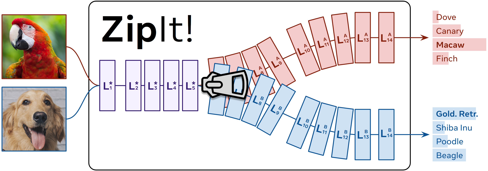

# ZipIt! Merging Models from Different Tasks *without Training* 

This is the official implementation of **ZipIt!** from our paper:

**[ZipIt! Merging Models from Different Tasks without Training](https://arxiv.org/abs/2305.03053)**  
[George Stoica](https://gstoica27.github.io/)\*, 
[Daniel Bolya](https://dbolya.github.io)\*, 
[Jakob Bjorner](https://www.linkedin.com/in/jakob-bjorner/), 
[Taylor Hearn](https://www.linkedin.com/in/taylor-hearn-521175128/), 
[Judy Hoffman](https://faculty.cc.gatech.edu/~judy/)  
Georgia Institute of Technology  
_[GitHub](https://github.com/gstoica27/ZipIt)_ | _[arXiv](https://arxiv.org/abs/2305.03053)_ | _[BibTeX](#citation)_

\*: Equal Contribution.  



## Section 1. Getting Started
Our repository is built off of python 3.7, with dependencies defined in the requirements.txt file. To run any experiment, it is recommended to create an evnironment using the dependencies provided. ZipIt! relies on pretrained checkpoints to perform model zipping, and this notebook contains several training scripts you can utilize to train multiple differently initialized models from scratch. Additionally, you may also experiment with your own already pre-trained models. 

### Section 1.1 Installation
Create a virtual environment and install the dependencies:
```bash
conda create -n zipit python=3.7
conda activate zipit
pip install torch torchvision torchaudio
pip install -r requirements.txt
```

## Section 2. Experiment Pipeline
This repository facilitates zipping arbitrary pretrained models from different initializations and different data together, while retaining performance in each's task. For most applications our repository can be directly used as is, without any additional coding required. However, it can also be easily adapted to many use cases by simply adding to a few files in its structure (more information below). 

### Section 2.1 Currently Supported Applications
We currently support *all* experimental settings presented in our paper. These include ResNet and VGG architectures trained on CIFAR label subsets - using either clip or cross entropy loss, and ResNet models trained on Imagenet1k, CUB, Oxford Pets, Stanford Dogs, and NA birds. 

#### Section 2.1.1 Experiment config
In order to run an experiment, we first need to decide which kind we want. The configs directory is a one-stop-shop for all experiments. Each config is a python file containing a dictionary of experiment instuctions, and is titled according to the kind of experiment desired. For instance, "cifar5_resnet20.py" contains instructions for setting up an experiment on CIFAR5 and using the ResNet20 model architecture. Please see the configs for more information - including what goes into crafting your own config for external experiments. Once you've decided on a config, you can run any experiment by replacing the "config_name" on any file with the name of the config you would like to use.

#### Section 2.1.2 Model
After selecting an experiment config, we need to check if the model architecture you would like to run is currently supported. We currently support ResNets, VGG, and SinGAN architectures of varying widths and scales, and their implementations can be found in the models directory. It is worth noting that passing the config specified in the previous section to our evaluation scripts will automatically load these desired models for evaluation - you do not need to perform any extra steps. However, if you would like to run a model that is missing from the directory, please see instructions listed [here](https://github.com/gstoica27/ZipIt/tree/master/models). 

#### Section 2.1.3 Graph
After selecting an experiment and model, we also need to check if we have an implementation of its computational graph already in our repository. These "Graphs" as we call them are DAGs whose nodes correspond to the actual torch modules of a respective model. For instance, the ResNetGraph object initializes a graph whose nodes (e.g., conv2d) correspond to the ResNet architecture defined in the "models/resnet.py" file. Unless you are adding a new model and thus need to define its graph, you do not need to change anything. If you would like to add a graph, please see the description [here](https://github.com/gstoica27/ZipIt/tree/master/graphs).

#### Section 2.1.4 Training
Training models for an experimental suite is straightforward. For all non-imagenet experiments, you can find existing training scripts under the "non_imnet_training_scripts" directory. This contains training scripts for CLIP and cross entropy loss experiments on CIFAR, NABirds, Oxford Pets, Stanford Dogs, and CUB, along any of the supported architecture. Each file in the directory is self contained, and provides instructions for training. For instance, one can train resnet models on cifar by just running 
```
$bash: python -m non_imnet_training_scripts.cifar_resnet_training
```
Training is relatively fast, and can train 10 ResNet20 models with width 16 in ~12 hours on an A40. Each script automatically handles model checkpoint saving. 
Note: We used the FFCV imagenet [repository](https://github.com/libffcv/ffcv-imagenet) to train our imagenet models. Similarly, we used the SinGAN [repository](https://github.com/kligvasser/SinGAN) to train our SinGAN models.

#### Section 2.1.5 Evaluation
Any supported experimental suite can be run in one of our evaluation_scripts directories. For non-imagenet experiments, please use "non_imnet_evaluation_scripts", otherwise please use "imnet_evaluation_scripts". Here we provide a list of each script corresponding to the kind of experiment it runs. All scripts record the Joint, Task Avg, and Per-Task performance for each model and write the results (+ other attributes) to a csv file.
- base_model_concept_merging.py: This script runs each pretrained model on the setting specified by the config, and the ensemble of all models. 
- auxiliary_concept_merging.py: This script merges each pretrained model along our implemented baseline matching functions (e.g., permute and weight avg) from the config and evaluates the result. 
- evaluate_gitrebasin.py: This script evaluates models previously merged using the gitrebasin implementation. For this, we utilize the official [repository](https://github.com/samuela/git-re-basin) to merge our models, and then evaluate them with this script.
- hyperparameter_testing.py: This script sets up a simple grid-search hyperparameter search experiment to find the best parameter settings for a matching function (e.g., ZipIt!).
- zipit_concept_merging.py: This script runs the ZipIt! matching function using the best hyperparameters given from the output of hyperparameter_testing.py. 
- multidataset_merging_hyperparams.py: Similar to hyperparameter_testing, this script runs a grid search to find the best hypeerparameters on the multi dataset merging experiment.
- multidataset_merging.py: This script evaluates merging using the best hyperparameters on the multi-dataset task.

Scripts for running imagenet experiments can be found in "imnet_evaluation_scripts". These files are structured similarly to the non imagenet scripts. 
- load_rebasin.py: loads and evaluates imagenet models merged using the gitrebasin repository.
- imnet200_ab.py: Evaluates any matching method across imagenet models.
- imnet200_hyperparam_search.py: Performs hyperparameter search to find the best matching function parameters.

Please see each file for more details on how a model is evaluated. 


### Section 2.2 Unsupported Applications
We currently only support applications discussed in our arXiv release. However, this repository can be adapted to any task, with only slight additions to its modular code base. Below we breakdown how to change the repository to accommodate each kind of desired task. 

- New Config: Please see [here](https://github.com/gstoica27/ZipIt/tree/master/configs) for instructions on how to add new configs.
- New Model: Please see [here](https://github.com/gstoica27/ZipIt/tree/master/models) for instructions on how to add a new model.
- New Graph: Please see [here](https://github.com/gstoica27/ZipIt/tree/master/graphs) for instructions on how to add a new graph. Note: REQUIRED if you add a new model architecture.
- New Dataset: Please see [here](https://github.com/gstoica27/ZipIt/tree/master/models) for instructions on how to add a new dataset.

After filling out the above steps according to your needs, you can directly use any training and evaluation script we currently have provided. The only changes required are to alter (1) the hardcoded config_name, (2) change the dataset wrapper to yours, and (3) optionally the save directories. If you would like, you can also define your own train/evaluation script and may use our scripts as a template if helpful. 


## Citation

If you use ZipIt! or this codebase in your work, please cite:
```
@article{stoica2023zipit,
  title={ZipIt! Merging Models from Different Tasks without Training},
  author={Stoica, George and Bolya, Daniel and Bjorner, Jakob and Hearn, Taylor and Hoffman, Judy},
  journal={arXiv},
  year={2023}
}
```

